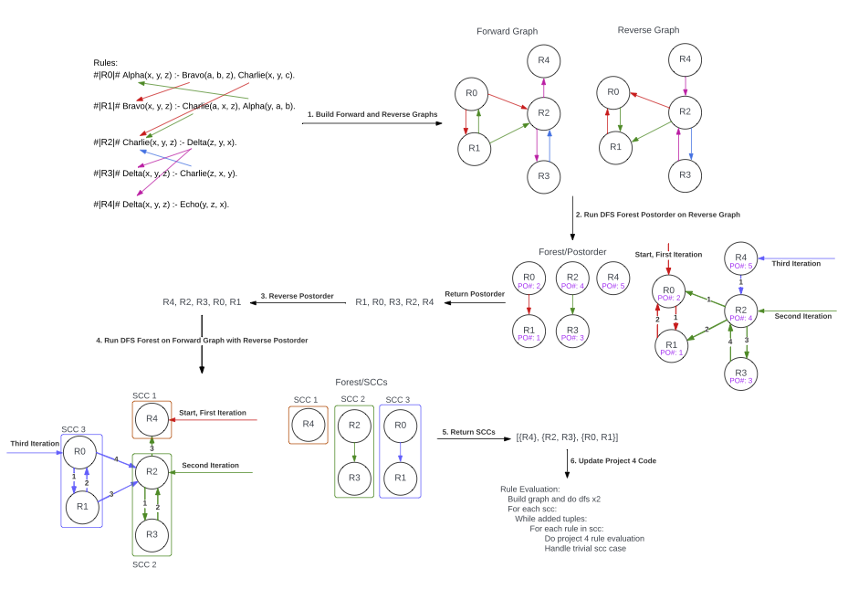

# Project 5

**WARNING:** the type on the interface for `get_rule_dependency_graph` has changed from Project 4 to be `dict[int, list[int]]`. **You need to update the type from `dict[str, list[str]]` to `dict[int, list[int]]` after copying in the file from Project 4.**

Similar to Project 4, This project uses the `lexer` and `parser` functions from Project 1 and Project 2 to get an instance of a `DatalogProgram`. It also uses the `Interpreter.eval_schemes`, `Interpreter.eval_facts`, and `Interpreter.eval_queries` from Project 3.

Project 5 differs from Project 4 in that it must implement the `Interpreter.eval_eval_rules_optimized` function according to the algorithm specified in the project description on [learningsuite.byu.edu](http://learningsuite.byu.edu) in the _Content_ section under _Projects_ -> _Project 5_. This algorithm groups rules into strongly connected components (SCCs), orders the components by dependency, and then evaluates the rules in each component to a fix-point. Here each component is considered separate from the other components meaning that there is a fix-point computed for each component and components are evaluated in the dependency order. This grouping and ordering minimizes the number of times each rule is evaluated.

You must track, and treat differently, _trivial_ SCCs. A trivial SCC is one that **only has a single rule and that rule does not depend on itself**. In other words, the rule does not have a self-loop in the dependency graph. If an SCC is trivial, then it only needs to be evaluated once! As such, the `Interpreter.eval_eval_rules_optimized` function should only yield one, and not two, evaluations for trivial SCCs. **All other non-trivial SCCs must iterate to a fix-point**.

You are expected to write tests for critical steps in the optimized algorithm. Specifically, you are expected to write tests for the dependency graph construction, finding the post-order rule ordering through a depth first search traversal, and computing SCCs. We recommend that the code for finding post-order numbers and computing SCCs be decoupled from the Datalog program and interpreter. Decoupling means that the code takes as input a dependency graph as specified by the `Interpreter.get_rule_dependency_graph` function. That graph has type `dict[int, list[int]]` where the key is the source rule and the list are the destination rules. An edge between rules is a dependency relation between the rules.

**Summary of Documentation**

* [README.md](README.md): describes project logistics and requirements
* [OPT_RULES_INTERP.md](./docs/OPT_RULES_INTERP.md): describes the optimized rule evaluation algorithm with the algorithm for computing SCCs
* Lecture notes in [learningsuite.byu.edu](https://learningsuite.byu.edu) and specifically the slides in the lecture _Project 5_.

**Before proceeding further, please review [OPT_RULES_INTERP.md](./docs/OPT_RULES_INTERP.md)**

## Project Overview and Major Steps

0. **Build the forward and reverse graphs**: detailed in [OPT_RULES_INTERP.md](./docs/OPT_RULES_INTERP.md) and foundational to the optimized rule evaluation. The graph captures the dependency between rules that update relations and rules tha consume those update relations.
0. **Run DFS Forest Post-order on Reverse Graph**: this step captures where any SCC starts in the graph and produces an order that if followed, guarantees that a simple DFS can be used to generate each SCC in the graph.
0. **Reverse Post-order**: here is the key observation for generating each SCC: taking the post-order numbers from the reverse graph, and then reversing that sequence, means that the next step will discover SCCs from the leafs up.
0. **Run DFS on th eForward Graph with Reverse PostOrder**: this step generates the actual SCCs in the graph.
0. **Return SCCs**: these are the inputs for optimized rule evaluation. The rules in each SCC are evaluated to a fix-point. So in the order the SCCs are generated, evaluate the rules in the current SCC to a fix-point, and then move to the next SCC.

## Developer Setup

The Project 5 setup is the same setup as for Project 4. You must create the virtual environment and activate it, install the package in the virtual environment, install pre-commit, and then copy over files for the solutions to the prior projects.

Here are the files to copy from Project 3 into the `src/project4/` folder:

  * `datalogprogram.py`
  * `fsm.py`
  * `interpreter.py`
  * `lexer.py`
  * `parser.py`
  * `relation.py`
  * `./tests/test_relation.py`
  * `./tests/test_interpreter.py`

The `token.py` file is unchanged here and should not be copied over. Other test files from older projects can be copied as needed.

**You need to fix all the imports in the copied file to replace `project4` with `project5` in the import path. You also need to make these changes in all the docstring tests. We recommend the use of the search feature in `vscode`, the magnifying glass in the sidebar, to search for `project4` in all files.**

## Project Requirements

1. The project must be completed individually -- there is no group work.
1. Project pass-off is on GitHub. You will commit your final solution to the `master` branch of your local repository and then push that commit to GitHub. Multiple commits, and pushes, are allowed. A push triggers a GitHub action that is the auto-grader for pass-off. The TAs look at both the result of the auto-grader on GitHub and your code to determine your final score. _See the cautions in the `#project-3` channel of the class Discord server about how using format strings can cause problems with pass-offs._
1. You must **use the math you did in Project 5a** to write tests in `tests/test_dependency_graph.py` for the functions relating to creating a dependency graph, reversing graphs, generating post-order traversal numbers, and computing SCCs.
1. You may use AI to write the code to construct a dependency graph, reverse a graph, generating post-order traversal numbers, and computing SCCs.
1. You must implement **without AI help** `Relation.eval_rules_optimized`.
1. Your code must not report any issues with the following code quality tool run in the integrated `vscode` terminal from the root of the project directory: `pre-commit run --all-files`. This tool includes _type checking_, which means that type annotations are required in your code.
1. Your code must pass each bucket in 150 seconds or less. If you have trouble meeting this requirement, see the FAQ in [RULES_INTERP.md](docs/RULES_INTERP.md).

## AI Policy for Project 5

AI may be used to write code for the key steps for finding the SCCs that determine the optimized rule evaluation **after you have done the math, and written the tests, for each of the steps as required in Project 5a on learningsuite**:
  * (Already defined in `Relation`) `def get_rule_dependency_graph(self) -> dict[int, list[int]]`
  * `def get_reverse_graph(graph: dict[int, list[int]) -> dict[int, list[int]]`
  * `def get_post_order_vector(graph: dict[int, list[int]])  -> list[int]`
  * `def get_sccs(graph: dict[int, list[int]]) -> Iterator[list[int]]`
You must implement **without AI help** `Relation.eval_rules_optimized`

## Submission and Grading

Submit Project 5 for grading by doing the following:

  * Commit your solution on the master branch
  * Push the commit to GitHub -- that should trigger the auto-grader
  * Goto [learningsuite.byu.edu](https://learningsuite.byu.edu) at _Assignments_ &rarr; _Projects_ &rarr; _Project 2_ to submit the following:
    1. Your GitHub ID and Project 2 URL for grading.
    1. A short paragraph outlining (a) how you prompted the AI to generate any code (if you used it) and (b) how you determined the quality and correctness of that code.
    1. A screen shot showing no issues with `pre-commit run --all-files`.
  * Confirm on the GitHub Actions pane that the pass-off tests passed, or alternatively, goto the Project 1 URL, find the green checkmark or red x, and click it to confirm the auto-grader score matches the pass-off results from your system.
